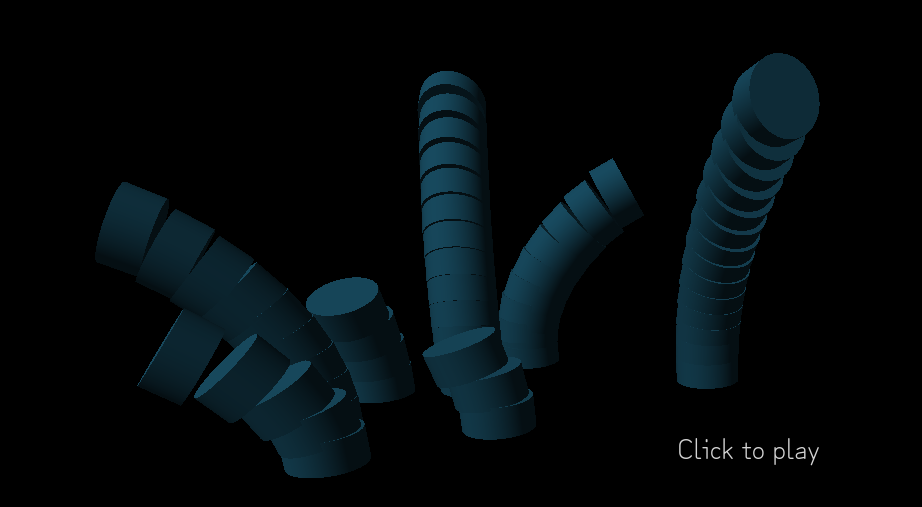

# Project 2 - Sound Exploration
## Process
### Week 1: October 12 - 18
#### Project Overview
The goal of this project is to create an interactive (possibly game-like) exploration of sound. The interactive sound experience that I will be creating will play like a first person game, though it's not much of a game as there is no objective other than to make weird song loops. The player will be able to "pull" these pool-noodle-looking creatures out of the ground, probably with an interaction like left click and drag, and then set them on an oscillation tragectory, probably with an interaction like right click -> drag -> release. Then each time the oscillating pool noodle thing bounces back and forth it chimes a note based on how long/tall the thing is.
#### MVP
As mentioned in the grading contract, the minimum viable product is the only thing that matters as far as the main deliverable of the project is concerned. I would certainly *love* to exceed the MVP, but when I'm juggling projects from literally every single class at once I need to keep my expectations realistic to avoid the pressure (that I put on myself) boiling over which would result in a worst product for all of my classes.

The main core gameplay/interaction loop described in the project overview is absolutely essential to the MVP: left click to change the thing's length (or create a new thing) and right click to change the speed at which it oscillates.

On top of the core interaction loop, I want at least one additional "setting" such as different instrumentation or filter profiles. In the extras section of this process log I'll mention all of the possible settings that I've brainstormed and I can pick from.

#### Extras
Even though I'm *supposed* to not pressure myself to include things above and beyond the MVP, there's a lot of stuff that I just really want to include as well:

The graphics are absolutely not essential to the MVP of this class; it's a sound class not a graphics class. But I would love for this project to look really nice, so if I have the time to, you know I'm gons'to be making it look pretty.

There are also a bunch of "settings" that I'd like to include that the player can change about the next noodle thing they will pull out of the ground. As mentioned earlier, I want to pick at least one of these to make it in to the MVP, and any more than that are extras:

  * Instrumentation change tied to color of the noodle. This could be a finite choice of colors mapped to a finite choice of samples, or it could be an entire color wheel selector mapped to parameters of a synthesizer.
  * Filter profile tied to shape of the noodle creature. A noodle dude that's fatter on the bottom than the top could have a low pass filter on whereas a noodle dude that's fatter on top than on bottom could have a high pass filter.
  * Reverb tied to the thickness of the outline of the noodle creature. Assuming I get there graphically where outlines matter...
  * Different faces on the noodle dudes tied to different ASDR presets to give them character.
  * A "quantize" button to optionally lock the oscillations of the noodle dudes to a 1/16 or 1/32 or 1/64 (probably customizable) grid.
  * A spatial audio on-off button (spatial audio will not be included in the MVP by default).

#### Technologies
Since most of the class is using Unity I thought it'd be worth mentioning that I'll be instead using a combination of web technologies because I'm interested in using this project as an opportunity to practice and further develop my skills with them:

 * Typescript
 * THREE.js
 * Tone.js

### Week 2: October 19 - 25
I originally was supposed to be very very close to my MVP by now, but the project deadline was extended by a week, which means I get to extend and spread out my development cycle by an extra week. And I didn't realize it at the time, but oh boy do I need that extra week right now with how busy everything has become. So instead of being super close to a complete MVP right now, that's my goal for this time next week. Instead of having just one main development week, I was able to extend the prototyping and learning phase into this past week and have a combined development-prototyping-learning week. And that was important, because this is still just the second project that I've ever created with THREE.js, as well as my second project I've ever created with Tone.js, and it's the first project that I've ever used the two together, so there was a lot of learning for me to do.

One of the more challenging things for me to learn was developing my own first person controller for the game. THREE.js does have an example "first person controller" that I tried using at first, but it is totally a different style of first person controller than any of us would associate with a first person game, so I had to build my own out of their "pointer lock controller". One thing I really like about the controller is how easy it is to implement a pause menu out of HTML and CSS. Currently, that pause menu has very basic controls shown on it.

Another big challenge I had to overcome this week was the act of finding out where in the world click events were happening. With no built in physics engine, I had a couple of options, adding invisible objects to the world and using the built in THREE.js raycasting support, or do some good old vector math and trigonometry. I'm like 99% sure the latter would be more performant, so despite the extra challenge, that's the option I went with.

I wanted to have a cylinder coming out of the ground at the location of the click, but I didn't end up having enough time to finish implementing that this week as I have a lot of other projects going on at the same time too. So I have just a basic test cube so far, moving around to the location of the click. The screenshot following screenshot shows how the game looks at this stage:

### Week 3: October 26 - November 1
Well the original plan was to have finished up in the middle of this week and then this process blog would contain the final touches of development and some reflection on how the project went. But like mentioned in the last process log, the deadlines for everybody's projects was pushed back a week, and so instead I have an extra week of development process log, and my reflection will come in a week from now. Last week I mentioned that I hoped to get the bulk of the development done this week, and in my grading contract I mentioned that I hoped to be at (or at least close to) minimum functionality by the Monday before the project was due. And I'm happy to report that I've succeeded in both of those deadlines! Starting from the where I was last week, I transformed the cube into a cylinder that I could then change the height of by pulling the camera up. The math for the "pulling up" part was really not easy at all, and it took a long time to get it right, but I got there in the end.

After I had the height able to smoothly adjust I had to prepare for the act of "bending" them to the side. I started by segmenting up the single cylinder into a bunch of shorter ones stacked on top of each other. This segmenting would allow me to pull each segment over a different amount to give the swing a more organic look, as well as give me a basis for discrete MIDI tones rather than smooth sweeping frequencies to be played by tone.js later. Then once the cylinder was split up into segments I once again had a million lines of trigonometry to write in order to figure out the math for bending the noodles from side to side. Eventually I got them looking pretty decent though!

Finally all I had to do this week was get the noodles to swing back and keep swinging back and forth once they are let go of, and then trigger tone.js to play a note when we get to one side! The first part was pretty easy with some linear interpolation, and the second part was also pretty easy, I just finished it up today, November 1st. I just had to create a tone.js synth that plays a note every time the noodle bounces based on how long the noodle is. It's not perfect yet, like when two notes play on top of each other, their waveforms can constructively and/or destructively interfere, making very weird sounds, but I'm hoping that I can fix that when I transition into hooking up tone.js into THREE.js's spatial audio, which is one of the "extras" that I'm hoping to include on top of the MVP. But for now I am glad to have gotten up to minimal functionality before the project is actually due, and I only have some fine tuning to do from here on out!

### Week 4: November 2 - 3
This week started with just two final days of development, trying to cram as many goodies and upgrades into the project as I can. Like I mentioned in my last process log, I had pretty much gotten the project to MVP state by the start of this week, and so the last two days before presenting the project were spent focusing on extras and add-ons to the MVP.

The first extra that I wanted to focus on was spatial audio, as I was hoping it would help solve my wave interference problem I was having with tone.js. Unfortunately getting tone.js's sounds to work in THREE.js's spatial audio system was not even remotely close to easy or straight forward like I expected, and at this point I pretty much think it's impossible. So in the end I decided that spatial audio was more important to me than synthesizing sounds on the fly, so I completely dropped tone.js from the project. I recorded notes with various synthesizer sounds in a DAW, and just loaded those notes into the game as samples to be played directly by THREE.js's spatial audio system. Abandoning tone.js alltogether also solved my constructive/destrictive wave interference problems, so I didn't have to worry about that either, which was also really nice!

The next additional feature that I added on top of the MVP was variation in instrumentation. I was originally imagining allowing the user to chose between various different "instruments" or synth sounds, but I didn't really have time for that. What I did have time for was to change the instrumentation very slightly from the bassier notes to the higher notes through automation of filters and profiles in the DAW.

And then finally once I had added a satisfactory ammount of sound/audio related extras, I got to move on to making the game look pretty as well! I added a whole bunch of pretty things, like a crosshair, a skybox, and the illusion of a floor. The floor actually moves around with the player, it's tied to the player's feet. And the floor's texture, just a simple repeating marble texture I made, scrolls around it's u-v coordinates to give the illusion of the player moving around on top of a floor, and the player can literally run for ever and the floor will never ever end. Once I added these textures, it gave me the visual context to realize that a lot of the math that I did last week was just a little bit off. Somewhere in my rat's nest of trigonomentry, something was going wrong and things weren't lining up totally perfectly, it was incredibly unsatisfying and annoying even though the diffrences were small. The controls felt inconsistent, and that made the game less fun to play. So I spent all night long overhauling the math and fixing up every small little mistake to make the controls feel so much better and more accurate, as well as to make the noodles bending look even more realistic and less out of place.

Once I got to that point I felt surely I would be done with the visual improvements, but then the morning the project was due, just a few hours before turning it in, I was playtesting it and it just didn't feel playful enough. So at the last minute, I decided to turn the playful factor up to 10: I added in a list of colors to randomly chose a noodle's color from, and then drew some faces on their top section. Finally I animated them such that each time the noodle sounds its note, it opens its mouth too to sing out the note. It just ended up being pure cutenesss in the end!

I'm really glad I ended up adding the faces last minute too, because when I presented this project to the class I could tell that they just absolutely loved it! I mean they loved the project as a whole, but the faces really added so much personality to it, and really pushed the project over the top from being pretty good to being absolutely wonderful and playful. I had people taking snapchat videos of my project because they wanted to save the memory themselves and/or share it with their friends outside of class, which made me feel really proud of the project as well. And there were multiple points where everybody just couldn't contain their laughter. This might have been one of the best receptions I've ever gotten to showing off a project of mine, and it made me feel really good, and I'm really proud of this project here as a whole.

## Grading Contract
What I've learned from working on so many ATLAS projects over the years is that what's most important to me is to have a well documented process log of the project. Something that I can not only show to any potential future employers, but also something that I can look back on to reflect on my own thought process through the project. I find it incredibly helpful to look back on my own thought process in a previous project if I find myself working on anything with any shared aspect. I've  looked back at my own undergraduate capstone project's process log at least 5 times now, not because I even remotely enjoyed reading my own (quite cringey because I never edited it for spelling mistakes or typos) writing, but because reviewing my own though process would make creating something related so much easier. All that is to say that my number one priority for this project to get an A is to have a clear well documented weekly progress log that covers my thought process througout the development of the project. Beyond a great process log, the next important thing to me is meeting the minimum viable product (MVP) for the project on time. I'd love to go beyond just an MVP for this project, I'd love that for all my projects, but I know that it's important for me not to put any pressure on myself to actually do that, and just an MVP is good enough for an A for me. And the third and final thing that I need to do to accomplish an A is to stay exploratory in the sound domain. 3D graphics and games are super fun and super cool to work on, and especially because they're still relatively novel to me as a developer even after several years, it's still really easy to get sucked into being experimental in the 3D graphics domain rather than the sound domain. I need to keep myself in line and not forget that the whole goal of the class is to do something with *sound* not with graphics. So to recap, my grading contract is as follows:
### Grade breakdown by letter
- **A**
  - Well documented weekly (Mondays) progress log
  - Roughly follows the predicted timeline documented below
  - Meets MVP (as described in week 1 process log)
  - Is about the *sound*
- **B**
  - Process log is missing a week, or is riddled with too many typos and grammatical errors
  - Actual timeline is significantly off from prediction (if I procrastinate too hard)
  - Project falls short of MVP
  - Focuses on graphics (or something else) more than on sound
- **C**
  - Process log is barely filled with any useful information at all
  - Multiple deadlines are missed
  - Something that's very much still "in development" to show by the end
  - Sound is just barely incorporated, nothing experimental at all
- **D** or **F**
  - Let's be honest, I'm not gonna allow this to happen to myself, but this could be if I just quit the project halfway through, or if I have like literally nothing to show by the end of the project (and no good reason either, like I would ask for an extension if I had a good reason, so I would need no good reason to fail), or if I blantantly plagiarize something that's obviously a 0% right there
### Timeline
- **Week 1**: October 12 - 18
  - The first process log, due Monday October 18 at class time, will be my official project proposal, detailing the main goals of my project, technologies I intend on using, the interactions the user will go through, what I intend to make into the MVP and what I think are the first things I want to add post-MVP, and finally a couple of drawings or wireframe mockups to visually communicate my ideas.
  - Also during this week I will be getting started on development of the project, though I'm not sure if I will include this in the week 1 process log or hold onto that documentation and save it for week 2 when I will be talking about 90% of the rest of the development.
  - Developmentally, by the 18th I want to have a prototype/proof of concept that is exploring the main interaction loop of the experience.
- **Week 2**: October 19 - 25
  - The second process log, due Monday October 25, will cover the vast majority of the development of the project, going over multiple fine development details and fun quirks that I experienced over the week (and a half) prior.
  - Developmentally I should be very close to my MVP that was outlined in the last week, as there's only 2 more days left after this process log before the due date/presentation day for the project. At this point I would *love* it if there were only a few details left to iron out, and some bug fixes to take place, instead of any significant development left.
- **Week 3**: October 26 - November 1
  - The third and final week of this project starts with a few last nights of (hopefully not crammed) development followed by presenting the project on October 27. After the project is completed and presented and everything I still want to turn in one last process log on Monday November 1, because I want to talk about how the project was recieved, and I want to try include the feedback that I got and the improvements that I should make, so that when I'm reflecting back on this process log in the future I can actually remember those things.
